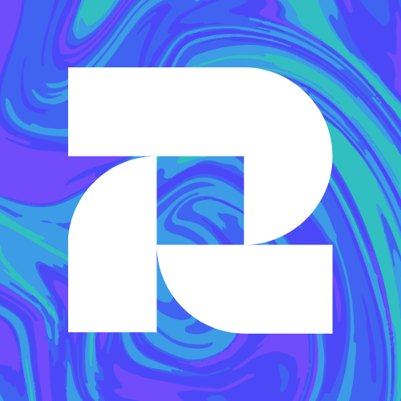

<p align="center">
  
</p>

<h1 align="center">Mockup Factory</h1>

<p align="center">
  <strong>Create stunning device mockups in seconds — 100% client-side, your images never leave your browser.</strong>
</p>

<p align="center">
  <a href="#features">Features</a> •
  <a href="#demo">Demo</a> •
  <a href="#getting-started">Getting Started</a> •
  <a href="#how-it-works">How It Works</a> •
  <a href="#templates">Templates</a> •
  <a href="#contributing">Contributing</a> •
  <a href="#license">License</a>
</p>

---

## ✨ Features

- 🔒 **Privacy First** — All image processing happens in your browser. No uploads, no servers, no tracking.
- 🖥️ **Web & Mobile Mockups** — Support for browser frames, iPhone, and Android device mockups.
- 🎨 **4-Step Wizard** — Simple flow: Select type → Upload image → Choose template → Download.
- ⚡ **Instant Preview** — See your mockup in real-time before downloading.
- 📱 **Responsive Design** — Works seamlessly on desktop and mobile devices.
- ⌨️ **Keyboard Navigation** — Navigate with Arrow keys, Enter, and Escape.
- 🔧 **Extensible Templates** — Easy to add new mockup templates via simple configuration.

---

## 🎬 Demo

Visit the live demo: **[mockup-factory.vercel.app](https://mockup-factory.vercel.app)** _(coming soon)_

### Quick Preview

```
┌─────────────────────────────────────────────────────────────┐
│                                                             │
│  1. Select Type    2. Upload    3. Template    4. Preview   │
│    ●────────────────○────────────────○────────────────○     │
│                                                             │
│       ┌─────────────────┐    ┌─────────────────┐            │
│       │   🖥️  WEB       │    │   📱 MOBILE     │            │
│       │                 │    │                 │            │
│       │  Browser frames │    │  Phone mockups  │            │
│       └─────────────────┘    └─────────────────┘            │
│                                                             │
└─────────────────────────────────────────────────────────────┘
```

---

## 🚀 Getting Started

### Prerequisites

- [Node.js](https://nodejs.org/) 18.x or higher
- [pnpm](https://pnpm.io/) (recommended) or npm/yarn

### Installation

```bash
# Clone the repository
git clone https://github.com/poyrazavsever/mockup-factory.git
cd mockup-factory

# Install dependencies
pnpm install

# Start the development server
pnpm dev
```

Open [http://localhost:3000](http://localhost:3000) in your browser.

### Build for Production

```bash
# Create production build
pnpm build

# Start production server
pnpm start
```

---

## 🔧 How It Works

Mockup Factory uses the **Canvas API** to composite images entirely in the browser:

```
┌─────────────────────────────────────────────────────────────┐
│                     BROWSER (Client-Side)                   │
├─────────────────────────────────────────────────────────────┤
│                                                             │
│  ┌─────────────┐    ┌─────────────┐    ┌─────────────┐      │
│  │    User     │    │  Template   │    │   Canvas    │      │
│  │   Image     │ +  │    PNG      │ =  │  Composite  │      │
│  │ (FileReader)│    │  (public/)  │    │    (API)    │      │
│  └─────────────┘    └─────────────┘    └──────┬──────┘      │
│                                               │             │
│                                               ▼             │
│                                        ┌─────────────┐      │
│                                        │  Download   │      │
│                                        │  (DataURL)  │      │
│                                        └─────────────┘      │
│                                                             │
└─────────────────────────────────────────────────────────────┘
                              │
                              ▼
                    ❌ NOTHING goes to a server
                    ✅ Everything stays in your browser
```

### Technical Stack

| Technology         | Purpose                             |
| ------------------ | ----------------------------------- |
| **Next.js 15**     | App Router, React Server Components |
| **TypeScript**     | Type safety                         |
| **Tailwind CSS 4** | Styling                             |
| **Canvas API**     | Image composition                   |
| **@iconify/react** | Icons                               |

---

## 📁 Project Structure

```
mockup-factory/
├── app/
│   ├── layout.tsx          # Root layout with Navbar & Footer
│   ├── page.tsx            # Home page with Wizard
│   └── templates/
│       └── page.tsx        # Template gallery page
├── components/
│   ├── ui/
│   │   ├── navbar.tsx      # Navigation bar
│   │   └── footer.tsx      # Footer
│   ├── shared/
│   │   ├── Toast.tsx       # Notification system
│   │   └── Loading.tsx     # Loading spinners
│   └── wizard/
│       ├── WizardContainer.tsx
│       ├── Stepper.tsx
│       ├── StepSelectType.tsx
│       ├── StepUploadImage.tsx
│       ├── StepSelectTemplate.tsx
│       └── StepPreview.tsx
├── lib/
│   ├── types.ts            # TypeScript definitions
│   ├── templates.ts        # Template manifest
│   ├── composeMockup.ts    # Canvas composition logic
│   ├── downloadImage.ts    # Download helpers
│   └── hooks/
│       ├── useWizard.ts    # Wizard state management
│       └── useToast.ts     # Toast notifications
├── public/
│   ├── logos/
│   │   └── logo.png        # App logo
│   └── templates/          # Mockup PNG files
│       ├── web-browser-light.png
│       ├── web-browser-dark.png
│       ├── mobile-iphone.png
│       └── mobile-android.png
└── README.md
```

---

## 🎨 Templates

### Available Templates

| Template       | Type   | Slot Size   | Border Radius |
| -------------- | ------ | ----------- | ------------- |
| Browser Light  | Web    | 1920 × 1008 | 0px           |
| Browser Dark   | Web    | 1920 × 1008 | 0px           |
| iPhone Mockup  | Mobile | 390 × 844   | 47px          |
| Android Mockup | Mobile | 424 × 915   | 36px          |

### Recommended Image Sizes

For best results, use images that match the template slot dimensions:

- **Web Mockups:** `1920 × 1008 px` (aspect ratio ≈ 1.9:1)
- **Mobile Mockups:** `390 × 844 px` (iPhone) or `424 × 915 px` (Android)

---

## 🤝 Contributing

We welcome contributions! Here's how you can help:

### Adding New Templates

1. Create your mockup PNG with a transparent area for the user's image
2. Add the template configuration to `lib/templates.ts`:

```typescript
{
  id: "my-new-template",
  label: "My Template",
  type: "web", // or "mobile"
  imagePath: "/templates/my-new-template.png",
  slot: { x: 0, y: 72, width: 1920, height: 1008 },
  borderRadius: 0, // for rounded corners (mobile devices)
}
```

3. Place your PNG in `public/templates/`
4. Submit a pull request!

### Development Guidelines

- Follow the existing code style
- Use TypeScript for type safety
- Test your changes on both desktop and mobile
- Ensure all images stay client-side (no server uploads!)

---

## 📄 License

This project is open source and available under the [MIT License](LICENSE).

---

## 🙏 Acknowledgments

- Device mockup designs inspired by various open-source projects
- Icons by [Iconify](https://iconify.design/)
- Built with [Next.js](https://nextjs.org/) and [Tailwind CSS](https://tailwindcss.com/)

---

<p align="center">
  Made with ❤️ by <a href="https://www.poyrazavsever.com">Poyraz Avsever</a>
</p>

<p align="center">
  <a href="https://github.com/poyrazavsever/mockup-factory/stargazers">Star this repo</a> •
  <a href="https://github.com/poyrazavsever/mockup-factory/issues">Report Bug</a> •
  <a href="https://github.com/poyrazavsever/mockup-factory/issues">Request Feature</a>
</p>
